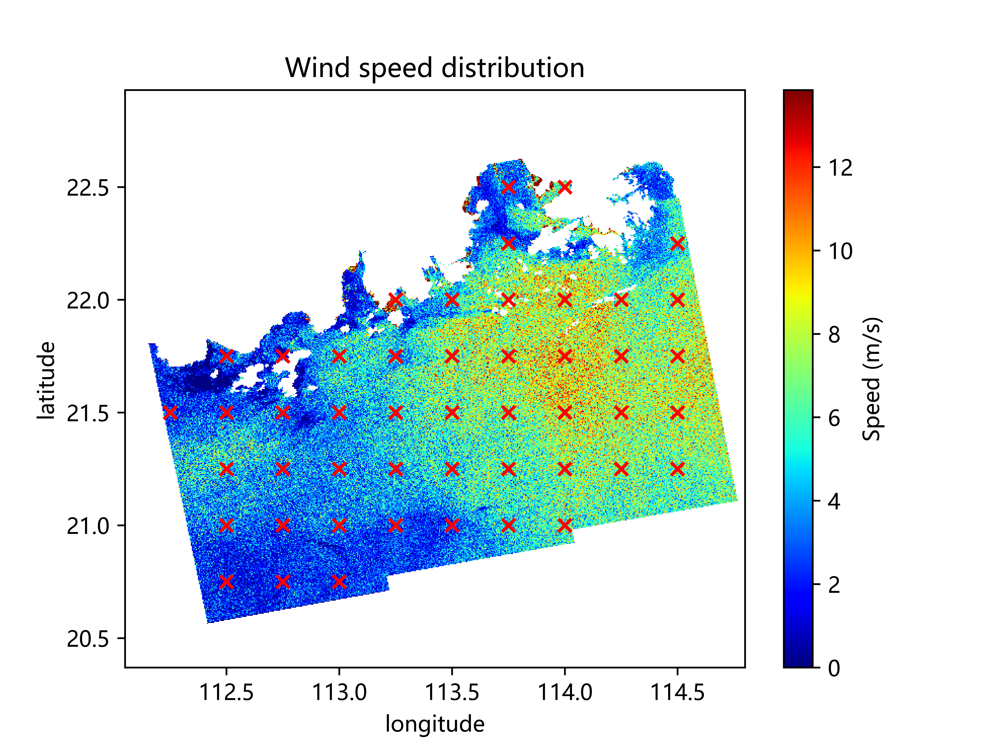
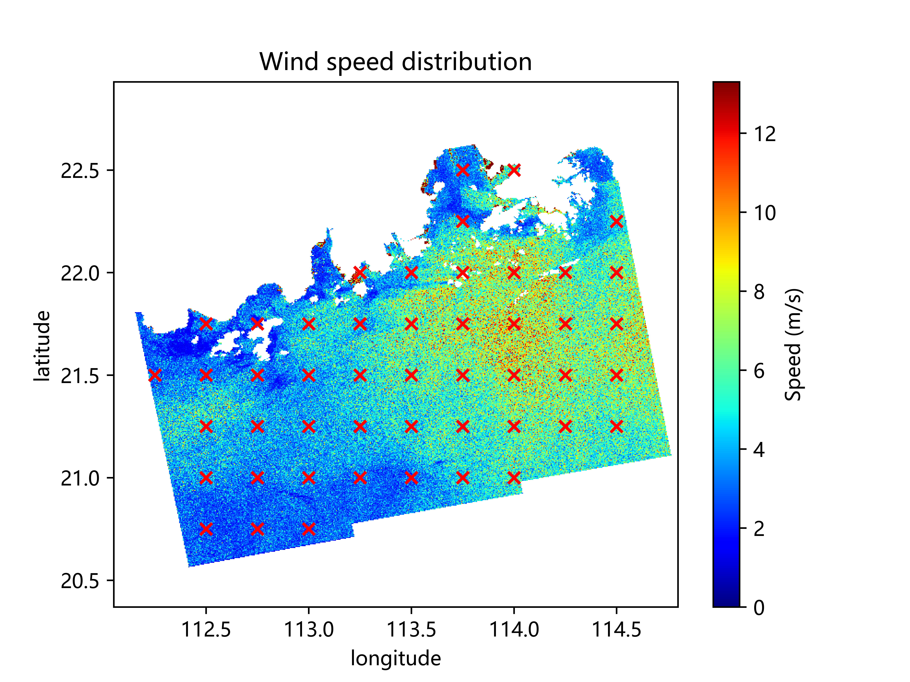
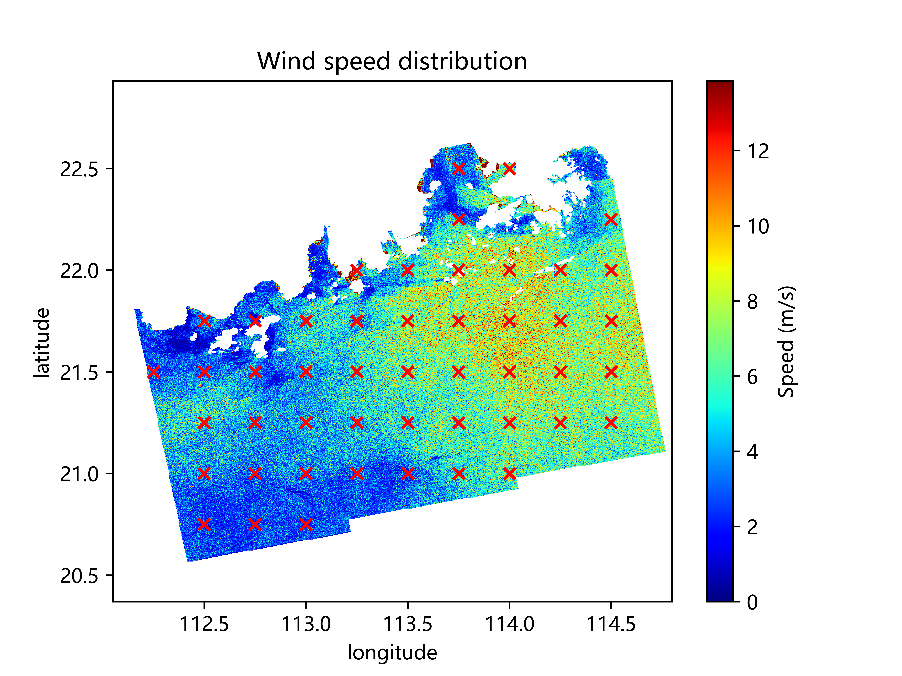
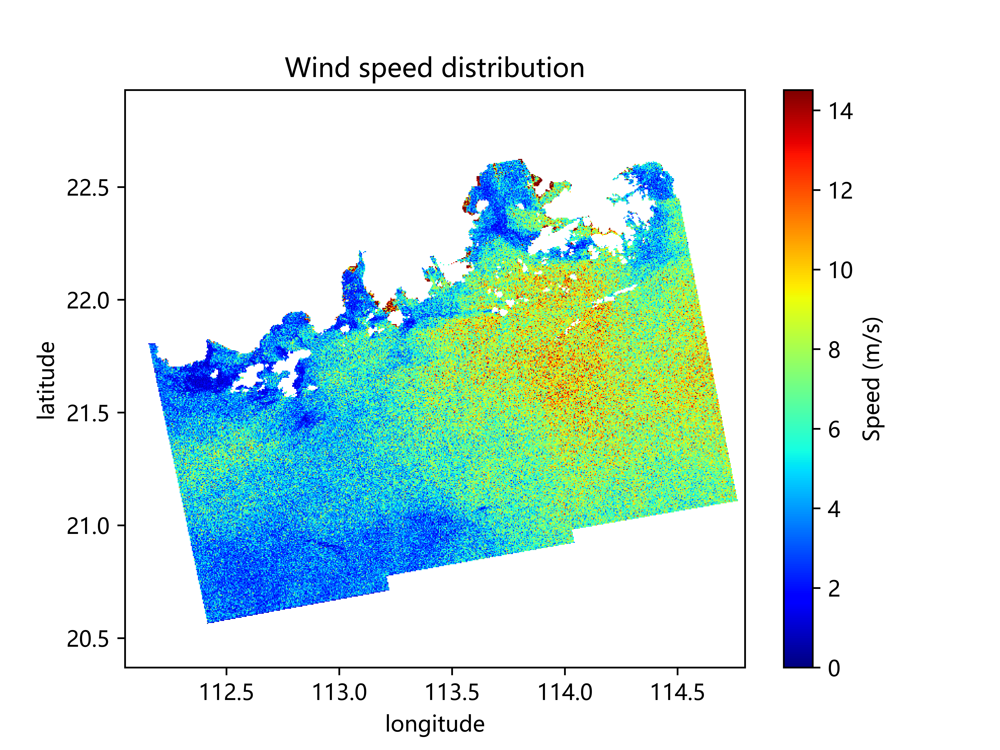

# 基于SAR的近海风能评估
大创 “基于SAR的近海风能评估” 项目文件  
## 项目简介
使用C波段SAR卫星数据进行风场反演。  
支持四种反演模型：CMOD_FIR2、CMOD4、CMOD5、CMOD5.N。

## 更新日志
#### 2024.10.10
- 添加 nc 文件读取函数、风向拟合函数、去极值化函数
- 修复 CMOD4 模型的公式错误问题
- 删除部分无用函数

## 项目结构
    SAR/
    ├── data/               # 数据存放位置
    │
    ├── Model/              # 模型包
    │   ├── __init__.py 
    │   ├── CMOD_IFR2.py    # CMOD_IFR2 模型
    │   ├── CMOD4.py        # CMOD4 模型
    │   └── CMOD5.py        # CMOD5、CMOD5.N 模型
    │
    ├── utils/
    │   ├── __init__.py     
    │   ├── filter.py       # 滤波器
    │   ├── func.py         # 函数集合
    │   └── netCDF4.ipynb   # netCDF4 库使用笔记
    │
    ├── main.py             # 主运行文件
    ├── README.md           # 项目简介
    └── requirements.txt    # 环境配置文件

## 下载安装
仓库克隆  

    git clone https://github.com/AGUSYSU/SAR.git

依赖库安装  

    pip install -r requirements.txt

若依赖库安装失败，推荐通过 conda 手动安装。

    conda install XXX

## 环境要求
python==3.9  
python版本无硬性要求  
依赖库详见requirements.txt

## 使用
运行main.py即可。  
修改原始数据（tif文件）路径，根据需求适当添加函数。

## 效果展示
以下图片为不同反演模型对苏拉台风(SAOLA, 2023.08.28)Sentinel-1卫星检测数据的反演风速图。  
使用反演模型依次为:  
左上CMOD-FIR2，右上CMOD4，左下CMOD5，右下CMOD5_N。

|  |  |
|------------------------|------------------------|
|  |  |
